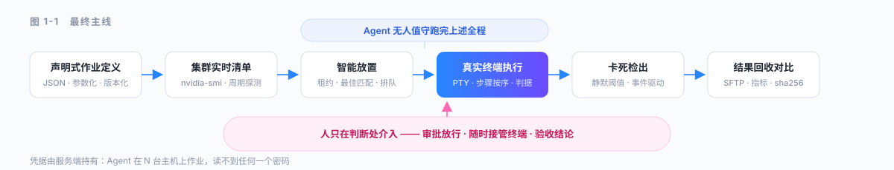
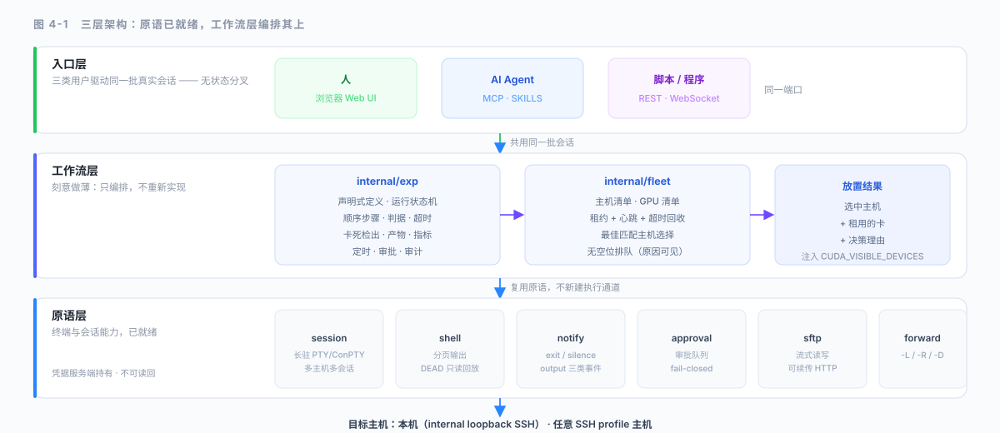
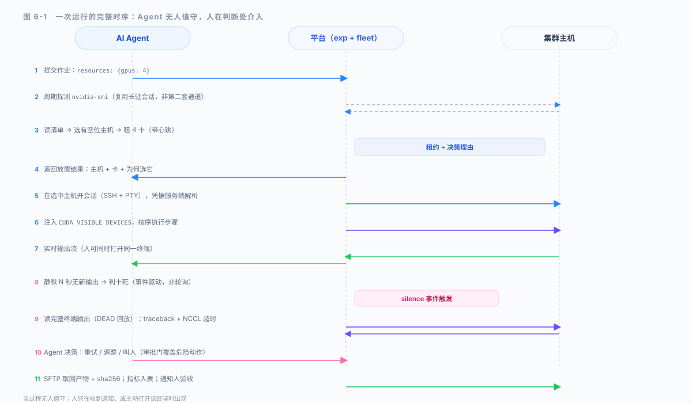

# 项目计划书 · 开题报告

# SuperbTmr

## 面向研究团队的 AI Native 终端平台：让 Agent 握住整个实验闭环

> 过去需要一个博士生盯着终端的事，现在 Agent 做，人只看结论。

```
声明式作业定义 → 集群实时清单 → 智能放置 → 真实终端自动执行 → 卡死检出 → 结果回收与对比
```

| 项 | 内容 |
|---|---|
| 文档类型 | 开题报告 / 项目计划书 |
| 参赛赛道 | AIC 全球校园人工智能算法精英大赛 · 算法创新赛道 · **AI+场景创新** |
| 项目阶段 | 开题（预注册） |
| 版本 | V1.0 |

---

## 目录

- [1 项目摘要](#1-项目摘要)
- [2 背景与问题提出](#2-背景与问题提出)
- [3 国内外研究现状](#3-国内外研究现状)
- [4 核心思路与创新点](#4-核心思路与创新点)
- [5 系统架构与安全模型](#5-系统架构与安全模型)
- [6 技术路线与可行性论证](#6-技术路线与可行性论证)
- [7 研究基础与前期准备](#7-研究基础与前期准备)
- [8 实施计划与进度安排](#8-实施计划与进度安排)
- [9 验收标准与预期成果](#9-验收标准与预期成果)
- [10 风险分析与应对](#10-风险分析与应对)
- [11 隐私与合规承诺](#11-隐私与合规承诺)
- [12 结论](#12-结论)
- [附录 A 预注册阈值汇总](#附录-a-预注册阈值汇总)
- [附录 B 术语表](#附录-b-术语表)

---

## 1 项目摘要

一个算法团队有一周时间验证一个新想法。实际发生的是：花半天手动分配显卡，把作业逐个敲进 `tmux`，每隔一小时去瞄一眼有没有卡死，半夜被一条 NCCL 超时叫醒，早上发现八张卡里六张从头到尾空着。**做研究的成本不在想，在等和盯。**

实验工具已经被解决过很多次了——实验追踪有 MLflow、WandB，分布式训练有 Determined、Slurm，远程终端有大量 SSH 客户端——而实验依然要人盯着。卡住它的不是工具，是 **Agent 的能力边界停在哪里**：

- **Agent 能发一条命令，但握不住一个终端。** 它跑 `exec`、读 stdout，然后进程就没了。而实验正好相反：它会停下来等确认，它需要一个被逐行驱动的 REPL，它会问 `[Y/n]`，它要在一个必须保持存活的东西里跑六个小时。在 Agent 能在一个真实机器上握住一个真实终端之前，它进不去的那一个循环，恰好就是研究赖以生存的那一个。
- **机器是不可寻址的。** 团队的主机是个人终端，凭据在聊天记录里，没有一张共享的视图说明哪张卡闲着。没有什么东西能安全地让 Agent 去操作，所以什么都不会动。

SuperbTmr 是一个 **AI Native 的终端平台**：多主机、多会话同时管理，全程可视化，由人和 AI 共同维护——任何一方都可以随时接管或交还给另一方。它以一个纯 Go 二进制交付，让三类用户驱动同一批真实终端：人（浏览器 Web UI）、AI Agent（MCP / SKILLS）、脚本与程序（REST + WebSocket）。

在此之上，**研究闭环**作为旗舰场景自然长出：Agent 自己登进机器、自己读实时输出、自己在检测到卡死时决定是该重试、该调整还是该叫人、自己把结果收回来。人只在下判断的地方出现——放行一个危险操作、验收一个结果。**过去需要一个博士生盯着终端的事，现在 Agent 做，人只看结论。**

本项目的方法学核心是**严谨先行**：在写工作流代码之前，先用相关工作矩阵划清"已有成熟工作"与"真正需验证的研究假设"，再用预注册（pre-registration）的方式把三个高风险 Gate 的通过阈值写死，确保实验结果不能被事后解释所美化。每个 Gate 都有明确的停止点与失败退路，任何一个不过，项目都有预设的、可独立成立的降级路径。

### 1.1 最终主线



### 1.2 预期成果

- 一个可运行的 **AI Native 终端平台**（多主机、多会话、人机接力、凭据服务端持有、字节级回放）；
- 一个建立在它之上的 **研究闭环工作流**（集群清单、智能放置、自动执行、卡死检出、产物回收、指标提取、跨运行对比）；
- 三个高风险 Gate 的**预注册实验结果**，以及诚实的通过/失败判定；
- 一组此前不可见、如今记录在案的**可测量指标**（排队等待、卡空置率、每步活跃度、无人值守完成率）；
- 可复现的实验协议、攻击与异常场景矩阵、失败边界报告，以及面向赛事的工程方案。

---

## 2 背景与问题提出

### 2.1 研究的成本不在想，在等和盯

大模型把"提出想法"的成本降到很低，但把想法变成结论的路径没有被同等压缩。一个研究周期的真实构成是：

| 环节 | 人工占比 | 说明 |
|---|---|---|
| 提出假设 | 低 | 已有大量 AI 辅助 |
| 分配资源 | 高 | 群里问"哪张卡空着"，答案是一张 `nvidia-smi` 截图 |
| 启动作业 | 高 | 逐个敲进 `tmux`，参数靠手改 |
| 等待与观察 | **极高** | 每小时瞄一眼；半夜被 NCCL 超时叫醒 |
| 失败定位 | 高 | 八张卡的日志散在八个终端里 |
| 结果比对 | 高 | 十次运行的十份数字散在十处 |
| 复现 | 高 | 没人能重跑上周二跑过的东西 |

其中"等待与观察"是纯人工、纯被动、且最容易被忽视的一项：它不产生任何新信息，却占据研究者几乎全部的业余时间。

### 2.2 现有工具为何不够

**表 2-1 现有实验工具及其结构性缺陷**

| 类别 | 代表 | 已解决 | 结构性缺陷 |
|---|---|---|---|
| 实验追踪 | MLflow、WandB、Neptune | 参数/指标记录与对比 | **要求插桩**：必须改代码加 SDK 调用；且只看得到你 `log` 进去的东西，看不到终端打印的东西 |
| 训练平台 | Determined、Kubeflow | 分布式训练调度 | 重、容器化、面向作业而非交互；一次任务失败即整体失败 |
| 工作流编排 | Airflow、Prefect、DVC | 任务依赖与版本 | 面向批处理 DAG，**杀死交互性**；无法驱动 REPL、调试器、安装向导 |
| 远程终端 | OxideTerm、各类 SSH 客户端、tmux | 人能登进机器 | 无资源模型、无实验生命周期、**无 Agent 入口**；凭据散落 |
| MCP 终端工具 | DesktopCommanderMCP、ssh-mcp 等 | Agent 能执行远端命令 | 一次性命令模型；**无会话复用、无人机值守、无人机接力** |
| AI SRE / 自主处置 | Ongrid、Aurora、各类 oncall-agent | 告警驱动调查与修复 | 与终端会话无关；且该赛道已有 100+ 工具的 awesome-list，属红海 |

这些工具有一个共同的结构性缺陷：**它们验证与调度的都是"可以被完整描述、完整提交、完整复现的作业"**。而真实研究工作大量是**无法预先完整描述的交互过程**——它需要一台活着的终端，需要人在关键时刻介入，需要把每一次字节都留下来。

### 2.3 目标场景与价值

锚定一个高频、刚需、且后果可量化的场景：**算法与系统研究团队的多机实验闭环**。

设想 Agent 提交一个需要 4 张卡的微调作业：它先读集群实时清单，在三台主机里选一台当前有四张空卡的，租下那些卡，注入匹配的 `CUDA_VISIBLE_DEVICES`，开会话并按序执行步骤；训练在 900 秒内没有新输出，它把该步骤判为卡死并读完整终端输出（traceback、NCCL 超时），决定重试还是上报；产物经 SFTP 流式取回并计算哈希，指标从输出里抽出来与上一次运行并排摆放。人只在收到通知时出现，验收结论。

这把"实验周转"这个含糊问题，转化为**一组可记录的字段**。

### 2.4 核心研究问题

1. Agent 在什么条件下才能**握住**一个真实的终端会话，而不只是发出一条命令？
2. 团队的主机如何成为**可寻址、可授权、可观测**的资源，同时凭据不进入 Agent 上下文？
3. 如何判断一个步骤是"在训练"还是"已经卡死"，且该判断不依赖轮询、不依赖人工观察？
4. 实验的哪些事实**此前完全不可见**，在被记录之后能否支撑跨运行的定量对比？
5. 如何在不过度承诺的前提下，清晰界定系统"能替人做什么、不能替人做什么"？

---

## 3 国内外研究现状

本章梳理与项目直接相关的五个方向，说明各自"已经走到哪里、还缺什么"，并据此定位本项目的切入点。

### 3.1 实验追踪与生命周期管理

以 MLflow（28k+ stars）、WandB、Neptune 为代表，已把参数记录、指标曲线、模型版本化做成基础设施。其边界在于：**它们是被动记录者**，需要实验代码主动调用 SDK 上报；且记录的是结构化指标，不是实验过程中终端上真正发生的事。

### 3.2 自主实验基础设施

以 `n-autoresearch`（结构化实验状态、REST 实验 API、keep/discard、崩溃恢复、多 GPU 并行）为代表，已经开始把"bash 循环 + git 当状态 + 扁平 TSV"替换为可查询的实验追踪。其边界在于：**单机多 GPU 假设、要求把实验重构成它的 project 格式、无 SSH 多主机、无交互式终端、无人机接力**。

### 3.3 远程终端与 SSH 工作区

以 OxideTerm（"AI-Powered SSH Client and Remote Operations Workspace"）、DesktopCommanderMCP（9.8k stars，MCP 终端控制 + 进程管理 + 输出分页）为代表，已把"人能在浏览器/客户端里操作远端机器"做得相当完整。其边界在于：**面向人的 GUI 客户端**，不是无头服务；无资源模型，无实验生命周期，无 GPU 感知，无放置策略。

### 3.4 MCP 与 Agent 工具生态

MCP 已成为 Agent 调用外部能力的标准。终端/SSH 类 MCP server 已有多个实现（`ssh-mcp-server`、`tmux-mcp`、`bridge-mcp` 等）。其共同边界在于：**工具粒度是"发一条命令"**，会话不保证长驻，输出不保证可回放，也没有"人可以在同一终端上接手"的机制。

### 3.5 AI SRE 与自主故障处置

以 Ongrid（"ops AI Agent that understands your infrastructure, finds the root cause, and fixes it"）、Aurora、各类 oncall-agent 为代表，已把"告警 → 调查 → 定位 → 修复"闭环做得相当成熟，且已有收录 100+ 工具的 awesome-list。本项目**不进入该赛道**：它与终端会话层无必然关系，且属红海；但其"人在高风险动作前放行"的设计被本项目借鉴为审批门。

### 3.6 研究空白与切入点

**表 3-1 研究方向对比与本项目定位**

| 研究方向 | 已解决的问题 | 未解决 / 本项目的补充 |
|---|---|---|
| 实验追踪 | 参数与指标记录对比 | 零插桩：读终端输出而非要求代码上报；交互式实验同样可跑 |
| 自主实验基础设施 | 实验状态可查询、可恢复 | 多主机 SSH、真实交互终端、人机接力 |
| 远程终端工作区 | 人能操作远端机器 | 无头服务 + Agent 可编程入口 + 资源感知放置 |
| MCP 终端工具 | Agent 能执行远端命令 | 会话长驻、字节级回放、审批门、无人机值守 |
| AI SRE 自主处置 | 告警驱动调查与修复 | 与本项目正交；仅借鉴其人工放行机制 |

综上，五类工作各自解决了链条上的一段，但没有人把 **"真实终端会话 + 多主机资源感知 + Agent 无人值守执行 + 人机接力"** 连成一个可度量、可回放、可降级的闭环。这正是 SuperbTmr 的切入点。

---

## 4 核心思路与创新点

### 4.1 理念转变：从"平台服务 Agent"到"Agent 握住闭环"

现有系统把 Agent 当作平台的**客户**——Agent 来调一个接口，平台返回一个结果。本项目把 Agent 当作终端前的**常驻工作者**——它自己登进机器、自己读输出、自己做判断、自己收结果，人只在判断处介入。

这一转变成立的前提是平台提供四样东西：**真实长驻的终端**、**可寻址的多主机**、**可观测可回放的字节**、**可打断的人机接力**。这四样都不需要新发明，需要的是把它们合成一个层，并在其上叠加工作流编排。

### 4.2 三层架构

**表 4-1 三层架构及各自职责**

| 层 | 职责 | 状态 |
|---|---|---|
| **终端与会话原语** | 长驻 PTY / ConPTY 会话、本机与 SSH、多主机多会话、分页输出、死会话只读回放、审批门、服务端凭据、退出 / 静默 / 输出通知 | **已完成** |
| **工作流层**（`internal/exp`、`internal/fleet`） | 声明式作业定义、集群实时清单与租约、智能放置、卡死检出、产物回收、指标提取、定时与审计 | **本期实现** |
| **入口层** | Web UI、MCP、SKILLS、REST + WebSocket——共用同一批会话 | **已完成** |

工作流层刻意做薄：启动步骤、读输出、等结束、发现静默、挡在人工决策之后、取回文件——这些原语层本来就已经具备。工作流层负责**编排**它们，而不是重新实现。



### 4.3 三个创新点

1. **零插桩的实验定义。** 作业是一份 JSON 文件，不是改过代码的工程。已有的脚本、REPL、安装器、会问 `[Y/n]` 的程序，原样即可作为步骤。这依赖平台跑在真实 PTY 之上，而非作业调度器——后者结构上无法驱动交互式过程。
2. **资源感知的整机放置。** 作业声明需要几张卡，平台读实时清单、选有空位的主机、租用并注入 `CUDA_VISIBLE_DEVICES`。**刻意不做跨机拆分单个作业**：跨机分布式训练每一步都要付一次同步税，且作为一个整体一起失败；整机放置保持快路径快，并让不同作业各自独立推进。
3. **人机接力的安全边界。** 危险步骤挡在审批门后；任何时刻人可接管那个确切的终端，而 Agent 同时继续处理其他所有事。凭据由服务端持有，Agent 在二十台机器上跑作业而读不到任何一个密码。

### 4.4 与相关工作的差异

| 对比项 | MLflow / WandB | n-autoresearch | OxideTerm / DesktopCommanderMCP | Slurm / K8s | **SuperbTmr** |
|---|---|---|---|---|---|
| 需插桩改代码 | 是 | 是（重构 project） | 否 | 否 | **否** |
| 跑交互式实验 | 否 | 否 | 人可，Agent 不可 | 否 | **是** |
| 多主机 SSH | 部分 | 否 | 是 | 是 | **是** |
| GPU 感知放置 | 否 | 单机多卡 | 否 | 否 | **是** |
| 会话字节级回放 | 否 | 部分 | 否 | 否 | **是** |
| 人可随时接管 | 否 | 否 | 是 | 否 | **是** |
| 凭据不进 Agent 上下文 | — | — | — | — | **是** |
| 无人机值守闭环 | 否 | 部分 | 否 | 部分 | **是** |

---

## 5 系统架构与安全模型

### 5.1 总体架构

```
┌─────────────────────────────────────────────────────────────┐
│  入口层   Web UI（人）  ·  MCP / SKILLS（Agent）  ·  REST/WS  │
├─────────────────────────────────────────────────────────────┤
│  工作流层  internal/exp            internal/fleet            │
│            定义 / 运行状态机        主机清单 · GPU 清单        │
│            步骤执行 / 判据          租约 + 心跳 · 放置策略      │
│            卡死检出 / 产物 / 指标    队列（无空位时等待）        │
├─────────────────────────────────────────────────────────────┤
│  原语层   session · shell · notify · approval · sftp · fwd   │
│            长驻 PTY/ConPTY · 分页输出 · 死会话回放 · 服务端凭据 │
├─────────────────────────────────────────────────────────────┤
│  目标     本机（internal loopback SSH） · 任意 SSH profile 主机 │
└─────────────────────────────────────────────────────────────┘
```

**探测机制与执行机制是同一套**：GPU 清单由长驻会话里周期性运行 `nvidia-smi` 产生，解析成集群视图；不存在第二套执行通道。

### 5.2 五个必须分开的问题

**表 5-2 五个必须分开的问题及系统回答**

| 问题 | 系统回答 | 主要机制 |
|---|---|---|
| 作业要在哪台机器上跑？ | 哪台当前有足够空卡 | 实时清单 + 租约 + 最佳匹配 |
| 步骤是否成功？ | 退出码与输出判据是否满足 | 期望声明（exit_code / output_contains） |
| 步骤是否还活着？ | 是否在静默阈值内有过输出 | `notify` 的 `silence` 事件（复用，非轮询） |
| 失败原因是什么？ | 完整终端输出是否可回放 | DEAD 会话只读回放 + SFTP 产物 |
| 这个动作该不该执行？ | 是否需要人工放行 | 审批门 + 人可随时接管终端 |

### 5.3 作业定义（V1 最小集）

**表 5-3 作业定义字段最小集**

| 字段 | 作用 | V1 要求 |
|---|---|---|
| `params` | 参数面；带 `values` 者成为扫描轴 | 必填可空 |
| `resources` | 需要几张卡、最低显存 | 放置的唯一依据 |
| `targets` | 候选主机池（`ssh_config` profile 名） | 至少一项 |
| `steps` | 有序步骤：argv、env、超时、判据、失败策略 | 至少一步 |
| `expect` | 退出码 / 输出包含 / 静默阈值 | 静默阈值可缺省 |
| `metrics` | 从输出抽取数字的正则 | 可缺省 |
| `artifacts` | 需取回的远端文件 | 可缺省 |
| `approval` | 是否需人工放行 | 默认否 |
| `notify` | 何时通知团队 | 默认 finish + fail |

**非功能约束**：第一版必须保持"一份 JSON + 一个放置器 + 一套判据"的最小逻辑；参数化网格上限 256 次运行（防止 `values` 笔误把扫描变成抽样）。

### 5.4 威胁模型与安全边界

**第一版假设操作环境具备**：团队自有或授权的主机；主机间 SSH 可达；Agent 由团队自己部署并受平台凭据隔离约束；使用者具备基本 Linux/GPU 运维知识。

**第一版暂不声称解决**：

1. 主机已被外部攻击者完全控制（此时终端输出本身不可信）；
2. 用户被胁迫主动放行审批门；
3. 平台所在机器被完整攻陷（此时服务端持有的凭据随之暴露）；
4. 训练框架自身不向终端打印有用信息（此时卡死检出只能依赖静默超时，无法定位原因）；
5. 所有未知的作业类型与所有自适应规避行为。

**安全表述边界**："卡死"表示该步骤在静默阈值内没有新输出，**不等价于对进程状态作绝对判定**；"已认证"表示审批门被人工放行，**不等价于对动作安全性作绝对保证**。

---

## 6 技术路线与可行性论证

### 6.1 阶段总览

**表 6-1 阶段总览（F1 → F5）**

| 阶段 | 名称 | 目标 | 出口判据 |
|---|---|---|---|
| **F1** | 集群清单与放置 | 主机/GPU 实时清单、租约、最佳匹配主机选择、无空位排队 | 一个 GPU 看板可持续反映真实卡状态；放置决策可解释 |
| **F2** | 定义与单机执行闭环 | JSON 定义、存储、运行状态机、顺序步骤、退出码与输出判据、`CUDA_VISIBLE_DEVICES` 注入 | 定义一个 3 步作业 → 一键跑 → 每步状态与实时输出可见 → 失败可点开看终端 |
| **F3** | 卡死检出与监控 | 静默阈值判卡死、步骤状态实时推送、团队通知、MCP 工具 | 跑一个会卡死的作业 → N 秒无输出自动标记 failed 并通知；Agent 可经 MCP 查询/发起 |
| **F4** | 结果可用化 | 产物 SFTP 回收与哈希、指标提取、跨运行对比、端口转发 tensorboard | 结果文件自动回收；同作业两次运行指标可并排 |
| **F5** | 团队治理 | cron 定时、审批门接入、审计轨迹 | 危险作业需人工批准；谁启动/改动了什么可查 |

### 6.2 三道 Gate 与预注册阈值

**表 6-2 三道 Gate 与预注册阈值**

| Gate | 必须回答的问题 | 通过阈值（预注册） | 未通过的处理 |
|---|---|---|---|
| **Gate A** | 放置器能否在真实集群上做出可解释的正确决策？ | 在 ≥3 主机的测试集群上，100 次放置请求全部落在"确有足够空卡"的主机上，且无一次与已租用卡冲突 | 退化为显式指定主机（保留清单与执行，放弃自动放置） |
| **Gate B** | 卡死检出是否可靠且不误报？ | 在构造的卡死样例上 100% 检出；在 20 次正常长时运行上 0 误报 | 提高默认静默阈值并降级为"提示"而非"判失败" |
| **Gate C** | Agent 能否无人值守跑完一个完整作业？ | 端到端无人工介入完成 ≥3 个连续作业，产物与指标全部回收，人仅收到通知 | 收缩为"半自动"：仅自动执行与监控，判断与放行交回人 |

**失败退路（F1 前已预设）**：若集群清单在生产环境不可靠，`resources` 退化为可选字段，作业回落到显式 `targets`；"声明式定义 + 真实终端执行 + 人机接力"仍可独立成立。

**项目管理价值**：三道 Gate 保证每个高风险假设都有明确停止点，避免清单、放置、执行、治理同时失控。

### 6.3 关键技术可行性

**6.3.1 真实终端上的多轮执行**
平台不新建执行通道：每个作业在选中的主机上开一个真实会话，步骤作为 argv 在其中按序执行。PTY（Windows 为 ConPTY）保证交互式程序可用；会话长驻并被复用，因此 REPL、调试器、安装向导都能像人一样被跨轮次驱动。

**6.3.2 零插桩的结果提取**
不要求实验代码调用 SDK。指标由正则从步骤输出中抽取——实验该打印什么就打印什么，平台只负责读。这换来一个代价：抽取失败时无法区分"没打印"与"打印了但正则不匹配"，因此指标声明必须与作业定义一同版本化，并在运行记录中留下未匹配的原始输出片段。

**6.3.3 卡死检出**
复用通知内核已有的 `silence` 事件：一个步骤声明静默阈值后，在阈值内无新输出即触发。这是**事件驱动而非轮询**——不额外占用会话，也不要求 Agent 反复查询。代价是"静默"不等于"卡死"（可能是长时间合法计算），因此阈值必须可配置且判据分层：默认只提示，显式声明后才判失败。

**6.3.4 凭据与服务端隔离**
连接 profile 由平台在服务端解析，MCP 读接口只返回 profile 名称。SSH 配置写工具默认关闭，需运维显式开启。密码、私钥、passphrase 一经写入不可读回。这是 Agent 能在二十台机器上作业而不读取任何一个密码的前提。

**图 6-1** 把上述四点串成一次完整运行的时序：从 Agent 提交作业，到平台放置、执行、检出、回收，全过程无人值守；人只在收到通知、或主动打开那个终端时出现。


### 6.4 依赖关系与关键路径

```
F1 集群清单与租约 ──→ F2 定义与执行闭环 ──→ F3 卡死检出与监控 ──→ F4 结果可用化 ──→ F5 治理
        │                      │                                        │
        │                      └── 需要 F1 提供"哪台有空位" ────────────────┤
        │                                                                   │
        └── F4 的产物回收依赖 F2 建立的会话 ─────────────────────────────────┘
```

**硬依赖（不可并行）**：F1 → F2 → F3。
**软依赖 / 可并行**：F4 的指标提取与 F3 的 MCP 工具可并行；F5 的审批门接入可随时插入（复用原语层已有的审批队列）。
**关键路径**：F1 → F2 → F3，是唯一不可压缩的链路；F4、F5 可在关键路径完成后并行推进。

---

## 7 研究基础与前期准备

### 7.1 终端与会话原语层已完成

- **代码规模**：Go 非测试代码约 13,800 行 / 51 文件；测试代码约 13,350 行 / 57 文件（测试与实现同量级）。
- **能力覆盖**：长驻 PTY / ConPTY、本机与 SSH 多主机多会话、分页输出、死会话只读回放、审批队列、服务端凭据、退出/静默/输出三类通知、SFTP 与可续传 HTTP 传输、端口转发。
- **工程纪律**：`go vet ./...` 零输出；`go test ./internal/...` 21 个包中 19 个有测试、18 个全绿（唯一失败项为硬编码 `echo` 的平台问题，已在 Linux 环境验证通过）；三平台 CI（ubuntu / macos / windows）全绿。
- **入口层**：Web UI（多语言、实时终端、会话仪表盘）、MCP（31 个工具、schema 紧凑可延迟加载）、SKILLS、REST + WebSocket 均已可用。

### 7.2 工作流层类型契约已完成

`internal/exp` 的类型契约已定稿并覆盖：`Experiment` / `Run` / `RunNode` / `StepState` / `ArtifactRef` / `RunResult` / `Schedule` / `AuditEntry`，以及参数解析（`ResolveParams`）与网格枚举（`Grid`，含 256 上限保护）与结构校验（`Validate`）。这使 F2 的执行语义在写代码前即被固定。

### 7.3 自描述与可观测性已具备

每个运行中的实例对外提供自己的 `/api.md` 与 `/skills.md`（免 token），并注册为 MCP resources 与 `learn-api` prompt。这意味着**新 Agent 无需额外文档即可驱动实例**，也是无人值守闭环的前置条件。

### 7.4 技术选型已确定

| 选型 | 理由 |
|---|---|
| Go，纯 Go 无 CGO | 单静态二进制跨平台原生交叉编译；goroutine 并发适合多会话长驻 |
| 单一端口四类入口 | 部署简单；人、Agent、脚本访问同一批会话，无状态分叉 |
| JSON 作业定义 | 与项目现有 manifest 一致，零新依赖；人可直接读改 |
| 探测复用会话层 | 不引入第二套执行通道，降低攻击面与维护成本 |
| 静默事件复用通知内核 | 卡死检出不轮询、不占额外会话 |

---

## 8 实施计划与进度安排

### 8.1 分期推进计划

**表 8-1 分期推进计划**

| 期 | 工作包 | 主要任务 | 里程碑 |
|---|---|---|---|
| **F1** | 集群清单与放置 | 主机/GPU 数据结构、租约与心跳、`nvidia-smi` 周期探测、最佳匹配选择、无空位排队 | GPU 看板 + 可解释放置决策 |
| **F2** | 定义与执行闭环 | JSON 解析与存储、运行状态机、每目标节点、顺序步骤、退出码/输出判据、超时、`CUDA_VISIBLE_DEVICES` 注入、REST + Web UI | 一键跑通 3 步作业 |
| **F3** | 卡死检出与监控 | 静默阈值判据、步骤状态 WebSocket 推送、`notify_user` 团队通知、MCP `exp_*` 工具 | 卡死自动检出 + Agent 可编程 |
| **F4** | 结果可用化 | SFTP 产物回收与 sha256、正则指标提取、跨运行并排对比、端口转发 tensorboard | 两次运行可定量对比 |
| **F5** | 团队治理 | cron 解析与触发、审批门接入、审计轨迹落盘 | 危险作业需人工放行 |

### 8.2 工作包拆解

#### WP1 集群清单与租约（对应 F1）
| 项 | 内容 |
|---|---|
| 任务 | 1.1 主机与 GPU 数据结构；1.2 `nvidia-smi` 周期探测（复用长驻会话）；1.3 输出解析为集群视图；1.4 租约结构与心跳；1.5 最佳匹配主机选择；1.6 无空位排队与原因记录 |
| 输入 | 原语层会话能力（已完成） |
| 输出 | 集群清单 + 放置决策（含理由） |
| 依赖 | 无（工作流层起点） |

#### WP2 定义与执行闭环（对应 F2）
| 项 | 内容 |
|---|---|
| 任务 | 2.1 JSON 解析、校验与版本化存储；2.2 运行状态机（pending → running → succeeded/failed/cancelled）；2.3 每目标节点创建与 session_id/shell_id 记录；2.4 顺序步骤执行与逐步状态记录；2.5 退出码与输出判据；2.6 超时；2.7 `CUDA_VISIBLE_DEVICES` 注入；2.8 REST 端点与 Web UI 页面 |
| 输入 | WP1（放置）+ 类型契约（已完成） |
| 输出 | 可一键执行的作业运行闭环 |
| 依赖 | WP1 |

#### WP3 卡死检出与监控（对应 F3）
| 项 | 内容 |
|---|---|
| 任务 | 3.1 静默阈值判据与分层（提示 / 判失败）；3.2 步骤状态实时推送；3.3 团队通知；3.4 MCP 工具暴露（查询 / 发起 / 取消） |
| 输入 | WP2 |
| 输出 | **Gate B** 结论 + 可编程入口 |
| 依赖 | WP2 |

#### WP4 结果可用化（对应 F4）
| 项 | 内容 |
|---|---|
| 任务 | 4.1 产物 SFTP 流式回收；4.2 sha256 归档；4.3 正则指标提取（含未匹配留痕）；4.4 跨运行并排对比；4.5 tensorboard 端口转发 |
| 输入 | WP2（与 WP3 可部分并行） |
| 输出 | 可定量对比的运行记录 |
| 依赖 | WP2 |

#### WP5 团队治理（对应 F5）
| 项 | 内容 |
|---|---|
| 任务 | 5.1 cron 解析与触发；5.2 审批门接入（复用原语层审批队列）；5.3 审计轨迹落盘 |
| 输入 | WP2–WP4 |
| 输出 | 定时 + 审批 + 审计三件套 |
| 依赖 | WP2–WP4 |

### 8.3 关键里程碑

| 里程碑 | 达成条件 | 对应 Gate |
|---|---|---|
| **M1** | 集群看板可持续反映真实卡状态；放置决策可解释 | Gate A |
| **M2** | 3 步作业一键跑通，每步状态与输出可见，失败可回放终端 | — |
| **M3** | 卡死自动检出并通知；Agent 可经 MCP 发起与查询 | Gate B |
| **M4** | 同作业两次运行指标可并排对比，产物已归档 | — |
| **M5** | 端到端无人值守完成 ≥3 个连续作业 | Gate C |

---

## 9 验收标准与预期成果

### 9.1 三道 Gate 判据

#### Gate A — 放置决策正确且可解释
- **步骤**：搭建 ≥3 主机测试集群 → 采集真实 `nvidia-smi` → 连续发起 100 次放置请求 → 核对每次落点。
- **通过**：100 次全部落在确有足够空卡的主机上；0 次与已租用卡冲突；每次决策附带理由（为何选该主机）。
- **未通过**：`resources` 退化为可选，作业回落到显式 `targets`；保留清单与执行能力。

#### Gate B — 卡死检出可靠且不误报
- **步骤**：构造卡死样例（运行后主动挂起的进程）→ 验证检出；同时跑 20 次正常长时作业 → 统计误报。
- **通过**：卡死样例 100% 检出；正常长时运行 0 误报；从卡死到通知的时延可测。
- **未通过**：提高默认阈值，判据降级为"提示"而非"判失败"，并明确记录该降级。

#### Gate C — Agent 无人值守闭环
- **步骤**：Agent 经 MCP 连续发起 ≥3 个作业，全程无人工介入 → 检查产物、指标、通知。
- **通过**：3 个作业全部完成，产物与指标全部回收，人仅收到通知；异常时有明确的上报路径。
- **未通过**：收缩为半自动（自动执行与监控保留，判断与放行交回人），并记录收缩原因。

### 9.2 分模块验收标准

**表 9-2 分模块验收标准**

| 模块 | 验收标准 |
|---|---|
| 集群清单 | 卡状态在阈值内反映真实变化；租约无冲突；心跳超时后卡被回收 |
| 放置 | 决策附带理由；无空位时作业排队且原因可见；同作业多次运行各自独立放置 |
| 执行 | 步骤按序执行；退出码与输出判据正确；超时生效；`CUDA_VISIBLE_DEVICES` 与租用卡一致 |
| 卡死检出 | 阈值内无输出即触发；判据分层可配；从卡死到通知时延可测 |
| 产物回收 | 声明的远端文件全部取回；sha256 记录；主机删除后产物仍在平台 |
| 指标提取 | 正则命中即抽取为数字；未命中时保留原始输出并标记 |
| 回放 | 运行结束后每节点完整终端输出仍可读 |
| 审批门 | 标记的步骤挂起至人工放行；AI 不能自行审批 |
| 审计 | 每次启动、修改、放行均记录时间、动作、对象 |

### 9.3 异常场景矩阵验收

**表 9-3 异常场景矩阵**

| 场景 | 预期行为 | 成功判据 |
|---|---|---|
| 训练进程静默挂起 | 静默阈值到点判卡死并通知 | 检出且时延可测 |
| 训练进程 OOM 崩溃 | 退出事件即到，该节点标 failed | 立即标记，无需轮询 |
| 某主机网络中断 | 该主机租约超时回收，作业失败可回放 | 卡被回收，无残留租约 |
| 无主机有空卡 | 作业排队并记录原因 | 队列可见，不静默失败 |
| 产物文件不存在 | 该 artifact 标记失败，不影响运行结论 | 失败被记录而非静默跳过 |
| 指标正则未命中 | 保留原始输出并标记未匹配 | 不产生虚假数值 |
| 人中途接管终端 | 接管期间写入串行化，Agent 继续其他作业 | 输入不冲突，状态一致 |
| 审批门被拒 | 该步骤不执行，运行记录拒绝原因 | fail-closed，事后不恢复 |

### 9.4 现场演示验收

| 场景 | 操作 | 应看到 |
|---|---|---|
| 正常闭环 | Agent 提交一个要 4 卡的作业 | 自动选主机 → 租卡 → 注入 → 执行 → 产物回收 → 指标入表 |
| 卡死检出 | 运行一个会挂起的步骤 | N 秒后判卡死并通知；完整终端输出可回放 |
| 无空位排队 | 占满所有卡后再提交 | 作业排队，仪表盘说明在等什么 |
| 人接管 | 运行中打开该终端 | 人可直接输入；Agent 不受影响 |
| 审批放行 | 提交带审批门的作业 | 挂起直至人在 Web UI 放行 |

### 9.5 预期成果

- 可运行的 **AI Native 终端平台**（多主机、多会话、人机接力、凭据隔离、字节级回放）；
- 建立其上的 **研究闭环工作流**（清单、放置、执行、卡死检出、产物、指标、对比、治理）；
- 三道 Gate 的**预注册实验结果**与诚实的通过/失败判定；
- 一组此前不可见、如今记录在案的**可测量指标**；
- 可复现的实验协议、异常场景矩阵、失败边界报告。

---

## 10 风险分析与应对

**表 10-1 风险与缓解**

| 风险 | 后果 | 缓解 |
|---|---|---|
| 集群清单在生产环境不可靠 | 放置决策错误 | F1 先做只读看板验证；`resources` 退化为可选，回落到显式 `targets` |
| 静默阈值误报正常长时作业 | 作业被错误判失败 | 阈值可配且判据分层（默认提示）；Gate B 专门统计误报 |
| 实验不向终端打印有用信息 | 指标抽取失败、卡死无法定位 | 指标与作业定义一同版本化；未匹配留痕；文档明确"打印什么决定能测什么" |
| 跨机拆分被误期望 | 用户期待分布式训练 | 文档与 spec 明确"整机放置"为设计决策，并说明理由（同步税与整体失败） |
| GPU 租约泄漏（作业崩溃未释放） | 卡被长期空占 | 租约带心跳与超时回收；崩溃/断线触发回收 |
| Agent 误读输出做出错误决策 | 错误重试或误上报 | 审批门覆盖危险动作；人可随时接管；审计轨迹可回溯 |
| 平台所在机器被攻陷 | 服务端凭据暴露 | 明确写入安全边界（第 5.4 节）；建议 TLS 反代 + 审阅模式 |
| 三平台 CI 的平台差异 | 某平台测试偶发失败 | 已有三平台矩阵；已知 `echo` 硬编码问题记录在案并计划修复 |

---

## 11 隐私与合规承诺

- **凭据隔离**：密码、私钥、passphrase 一经写入不可读回，明文不进入 Agent 上下文；MCP 读接口只返回 profile 名称。
- **最小暴露**：SSH 配置写工具默认关闭，需运维显式开启；非 loopback 绑定必须配置认证。
- **审计可查**：每次作业启动、定义修改、审批放行均记录时间、动作与对象。
- **数据归属**：产物与终端输出保存在团队自有的平台数据目录中，不经过第三方服务。
- **不做内容语义分析**：平台记录终端字节与结构化状态，不对实验内容作语义判断。
- **可降级**：媒体/产物回收失败、审批门被拒、网络中断均有明确降级路径，不允许静默放行。

---

## 12 结论

SuperbTmr 不是又一个实验追踪器，也不是又一个远程终端客户端。它是一个 **AI Native 的终端平台**，让 Agent 第一次能够握住一个真实的终端会话，并在此基础上把研究团队最耗时、最被动、最不可见的那段工作——等待与观察——变成可自动执行、可自动检出、可回放、可度量的闭环。

它的创新不在任何单项技术，而在**融合方式**：真实 PTY 会话、多主机资源感知、Agent 无人值守、人机接力，这四件事此前各自存在，却从未被合成一个可度量的闭环。每一项单独看都有人做过，合在一起做成的平台不存在——这正是本项目在"AI+场景创新"上的定位。

它的价值也不在"更快"，而在**把原来必须人盯着的事交出去，同时不放弃人在关键时刻的方向盘**。

**一句话答辩表述**：SuperbTmr 不是让 Agent 代替人做研究，而是让 Agent 代替人**盯着终端**——它自己登进机器、自己读输出、自己在卡死时读懂报错并判断该重试还是该叫人、自己把结果收回来；人只在下判断的地方出现，而每一次运行的完整过程都留得下来、回得去。

---

## 附录 A 预注册阈值汇总

| Gate | 指标 | 预注册阈值 | 未通过动作 |
|---|---|---|---|
| **A** | 放置正确率 | 100/100 落在有空卡主机 | `resources` 退化为可选 |
| **A** | 租约冲突 | 0 次 | 同上 |
| **B** | 卡死检出率 | 100%（构造样例） | 提高阈值并降级为提示 |
| **B** | 正常长时误报率 | 0%（20 次） | 同上 |
| **C** | 无人值守完成 | ≥3 个连续作业 | 收缩为半自动 |

## 附录 B 术语表

| 术语 | 含义 |
|---|---|
| **作业（job）** | 一份可版本化的 JSON 实验定义，含参数、资源需求、候选主机、步骤、判据、指标与产物 |
| **运行（run）** | 作业的一次执行实例，含每目标节点与逐步状态 |
| **节点（node）** | 运行在某一台主机上的那一份，记录其 `session_id` / `shell_id` |
| **集群清单（fleet）** | 由长驻会话周期性探测得到的主机与 GPU 实时视图 |
| **租约（lease）** | 某次运行对特定 GPU 的排他占用，带心跳与超时回收 |
| **放置（placement）** | 依据 `resources` 与实时清单选择主机的过程 |
| **静默阈值（silence timeout）** | 步骤在该时长内无新输出即被判卡死 |
| **DEAD 会话** | 已关闭、退出、崩溃或重启后的会话，输出仍可只读回放 |
| **审批门（approval gate）** | 危险动作执行前必须经人工放行的机制 |
| **预注册（pre-registration）** | 在实验前写死通过阈值，防止结果被事后解释美化 |
